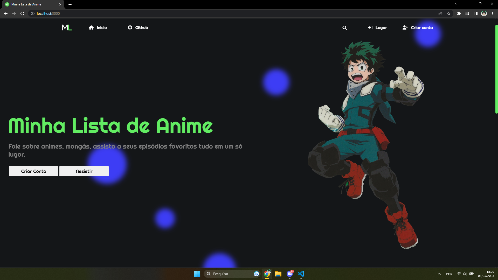

# Minha Lista de Anime

Minha lista de Anime é um site para debater sobre animes

## 🙋 Contribuição

Esse projeto é de codigo aberto, qualquer sugestão, correção de bug's ou criticas são sempre bem vindas.

## 🏠 Como hospedar esse projeto

Primeiro, instale manualmente esse repositorio em seu computador ou clone-o, usando o comando `git clone`.

Esse projeto utiliza TypeScript, então instale o TypeScript

**npm:**
```
npm install typescript --save-dev
```
**yarn:**
```
yarn add typescript --dev
```

*Não esqueça de instalar todos os pacotes (package.json).*

Instale também o `ts-node`.

Depois de tudo instalado e configurado, basta rodar o codigo, você pode rodar usando o `ts-node`:

```
npx ts-node src/server.ts
```

*(Não é possivel compilar para JavaScript usando o comando `tsc`, já que os arquivos `.ejs` não podem ser compialdos, para "corrigir" isso, você pode ver esse exemplo de como implementar: https://developer.okta.com/blog/2018/11/15/node-express-typescript (mas por enquanto o `ts-node` não parece apresentar nenhum erro para rodar os códigos.))*

Depois de executado o comando e se tudo tiver ocorrido certo você ira ver uma mensagem no terminal (Servidor rodando na porta 3000).

Para acessar o site, vá no seu naveagor e digite na barra de pesquisa:

```
http://127.0.0.1:3000/
```
**ou**
```
http://localhost:3000/
```

*Ao acessar você tabém vera algo parecido com isso (Captura de tela tirada em 08/04/2023):*


<br><br>

*Esse arquivo foi escrito por Mateus no dia 08/04/2023 as 01:21*